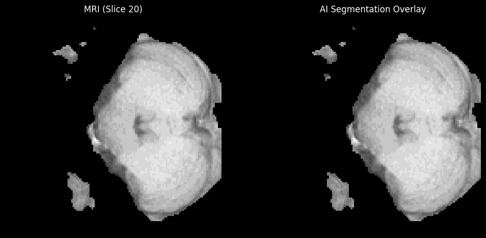
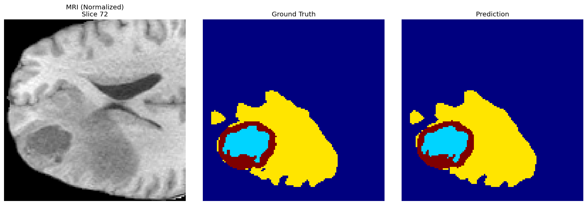
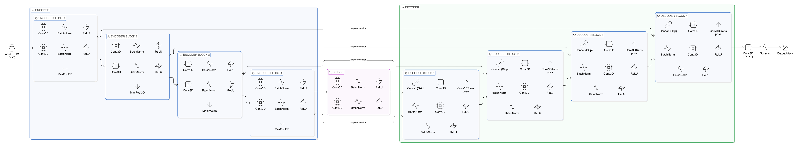

# 3D Brain Tumor Segmentation (U-Net)

## Project Overview
This project implements a **3D U-Net** architecture to perform volumetric segmentation of brain tumors from multimodal MRI scans (BraTS 2020 dataset). The model identifies three tumor sub-regions: **Necrotic Core**, **Peritumoral Edema**, and **Enhancing Tumor**.

## Data Pipeline
The project processes multimodal MRI scans (T1, T1ce, T2, FLAIR) using a custom pipeline designed for high-dimensional medical data.

1. **Preprocessing & Volume Handling:**
   - **NIfTI Loading:** Utilizing `nibabel` to load 4D volumetric data (240x240x155x4).
   - **Cropping:** Automated extraction of the brain region, reducing volume to **128x128x128** voxels to optimize GPU memory usage without losing critical tumor information.
   - **Normalization:** Applied Z-Score normalization per channel to handle intensity variations between patients.

2. **Efficient 3D Data Loading (Memory Management):**
   - Engineered a custom `DataGenerator` (inheriting from `tf.keras.utils.Sequence`) to handle memory-intensive 3D MRI volumes.
   - **Processing:** Loads batches dynamically, enabling training on GPU without OOM errors.
   - **One-Hot Encoding:** Converts segmentation masks into 4-channel categorical arrays.

3. **Format Management:**
   - **Export Capabilities:** Predictions can be exported to `.nii` format while preserving original affine transformations for clinical visualization tools.

### Key Results
Evaluation performed on the independent test set. The model achieves state-of-the-art performance in detecting the Whole Tumor region.

| Region               | Description                      | Mean Dice Score | Best Case |
|:---------------------|:---------------------------------|:----------------|:----------|
| **Whole Tumor (WT)** | Visible Edema + Core + Enhancing | **0.93**        | **0.98**  |
| **Tumor Core (TC)**  | Necrotic Core + Enhancing Tumor  | **0.90**        | **0.98**  |
| **Enhancing (ET)**   | Active Enhancing Tumor (Class 3) | **0.79**        | **1.00**  |

> *Results indicate high segmentation accuracy, particularly for the Whole Tumor (0.93 Dice) and Tumor Core (0.90 Dice) regions. These metrics confirm that the Hybrid Loss function effectively handled the class imbalance problem, producing reliable masks for volumetric measurement.*
---

## Visualizations

### 1. Volumetric Fly-through (GIF)

### 2. Best Case Prediction (Dice: 0.98)

> *Cyan = Necrotic Core, Yellow = Edema, Red = Enhancing Tumor*

## Architecture & Technical Approach
The model is based on the **3D U-Net** architecture ([Çiçek et al., 2016](https://arxiv.org/abs/1606.06650)), a volumetric extension of the original U-Net ([Ronneberger et al., 2015](https://arxiv.org/abs/1505.04597)), optimized for multimodal brain tumor segmentation.

### 1. Model Structure
- **Encoder:** 4 blocks, each consisting of two Conv3D → BatchNorm → ReLU sequences followed by MaxPool3D for downsampling.
- **Bridge (Bottleneck):** Two Conv3D → BatchNorm → ReLU sequences at the deepest level of the network.
- **Decoder:** 4 blocks, each using Conv3DTranspose for upsampling, concatenation with skip connections from the encoder, followed by two Conv3D → BatchNorm → ReLU sequences.
- **Skip Connections:** Feature maps from each encoder level are concatenated with the corresponding decoder level to preserve fine-grained spatial information.
- **Output:** 1×1×1 Conv3D with Softmax activation for voxel-wise classification into 4 mutually exclusive classes.

| Component | Original U-Net | This Implementation |
|:----------|:---------------|:--------------------|
| Dimensionality | 2D | **3D** (volumetric) |
| Loss Function | Cross-Entropy | **Hybrid (Dice + CCE)** |
| Input Channels | 1 | **4** (T1, T1ce, T2, FLAIR) |
| Output Classes | 2 (binary) | **4** (multi-class) |
| Normalization | None | **BatchNorm after each Conv3D** |

### 2. The "Class Imbalance" Challenge
Initial training resulted in background bias (the "Cyan Square" artifact), where the model classified air as tumor tissue due to the overwhelming number of background voxels.

**Solution: Hybrid Loss Function**

To address this, I engineered a custom loss function combining two metrics:

$$\mathcal{L}_{hybrid} = \mathcal{L}_{Dice} + \mathcal{L}_{CCE}$$

1. **Dice Loss** — Optimizes the overlap of the tumor shape (insensitive to background size):

$$\mathcal{L}_{Dice} = 1 - \frac{2 \sum_{i} p_{i} \cdot g_{i} + \epsilon}{\sum_{i} p_{i} + \sum_{i} g_{i} + \epsilon}$$

2. **Categorical Cross-Entropy** — Heavily penalizes false positive classifications in the background.

## References & Data
This project utilizes the **[BraTS2020 Dataset](https://www.kaggle.com/datasets/awsaf49/brats20-dataset-training-validation)**.

**Architecture references:**
1. Ronneberger, O. et al. (2015). *U-Net: Convolutional Networks for Biomedical Image Segmentation.* [arXiv:1505.04597](https://arxiv.org/abs/1505.04597)
2. Çiçek, Ö. et al. (2016). *3D U-Net: Learning Dense Volumetric Segmentation from Sparse Annotation.* [arXiv:1606.06650](https://arxiv.org/abs/1606.06650)